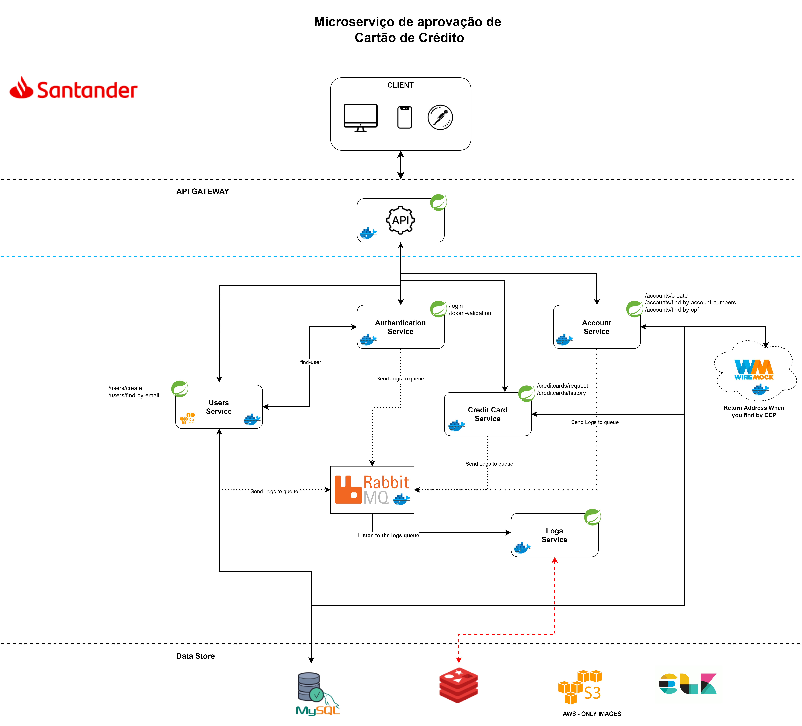

# Credit Card Approval

<!-- TABLE OF CONTENTS -->

## Table of Contents
* [About The Project](#about-the-project)
* [Design Solution](#design-solution)
* [Built With](#built-with)
* [Getting Started](#getting-started)
* [Installation](#installation)
* [Usage](#usage)
* [Roadmap](#roadmap)
* [Contributing](#contributing)
* [Contact](#contact)

<!-- ABOUT THE PROJECT -->
## About The Project
This project is just a backend challenge in which the subject was chosen by the developer and I decided to create app related to the client who presented the challenge. 
 
<ul>
    <li>Make a solution design to explain your application</li>
    <li>Your application must provide the ability to perform zip code search operations in an external API (preferably to make the API mocked with Wiremock, Mockoon or similar)</li>
    <li>The query logs must be recorded in a database, with the time of the query and the data returned from the API</li>

</ul>

The objective will be to create an application that validates customer information to know if they are approved or not to obtain the credit card according to the following criteria:
 
 

### See the table

<table>
   <thead>
      <tr>
         <td>Age</td>
         <td>Has job</td>
         <td>Own House</td>
         <td>Score</td>
         <td>Result</td>
      </tr>
   </thead>
   <tbody>
      <tr>
         <td>Young</td>
         <td>false</td>
         <td>false</td>
         <td>fair</td>
         <td>Not Approved</td>
      </tr>
      <tr>
         <td>Young</td>
         <td>false</td>
         <td>false</td>
         <td>good</td>
         <td>Not Approved</td>
      </tr>
      <tr>
         <td>Young</td>
         <td>true</td>
         <td>false</td>
         <td>good</td>
         <td>Approved</td>
      </tr>
      <tr>
         <td>Young</td>
         <td>true</td>
         <td>true</td>
         <td>fair</td>
         <td>Approved</td>
      </tr>
      <tr>
         <td>middle</td>
         <td>false</td>
         <td>false</td>
         <td>fair</td>
         <td>Not Approved</td>
      </tr>
      <tr>
         <td>middle</td>
         <td>false</td>
         <td>false</td>
         <td>good</td>
         <td>Not Approved</td>
      </tr>
      <tr>
         <td>middle</td>
         <td>yes</td>
         <td>yes</td>
         <td>good</td>
         <td>Approved</td>
      </tr>
      <tr>
         <td>middle</td>
         <td>false</td>
         <td>true</td>
         <td>excellent</td>
         <td>Approved</td>
      </tr>
      <tr>
         <td>old</td>
         <td>true</td>
         <td>true</td>
         <td>fair</td>
         <td>Not Approved</td>
      </tr>
      <td>old</td>
         <td>false</td>
         <td>true</td>
         <td>good</td>
         <td>Approved</td>
      </tr>
   </tbody>
</table>

## Design Solution

<!-- Built With -->
## Built With
This project was made with:
   <ul>
      <li><a href="#">Spring Boot</a></li>
      <li><a href="#">Docker</a></li>
      <li><a href="#">RabbitMQ</a></li>
      <li><a href="#">Redis</a></li>
      <li><a href="#">Mockwire</a></li>
   </ul>

<!-- GETTING STARTED -->
## Getting Started
You simply clone the project over. After doing so go to your command terminal and type `docker compose up -d` this will allow you to get the run in you machine.

After start open this link to seen documentation `https://app.swaggerhub.com/apis-docs/CULYSSANDERCENTRO_1/credit-card-approval-api-docs/v0`

<!-- Prerequisites -->
You need to have docker in your machine to start.
You can see this preview video about it.

### Installation

1. Clone the repo
   sh
   git clone link https://github.com/culyssander/credit-card-approvel

<!-- USAGE EXAMPLES -->
### Usage
It's a perfect project for those who want to get into the world of microservices. If you'd like to learn more about the project's architecture and other microservices solutions, watch the video on my YouTube channel.

<a target="_blank" href="https://www.youtube.com/watch?v=Wwo-mSIWymc&list=PLqs4l_WmH-7BJfCoaWj4j_MXj4jSr8edO">Playlist of Sales Microservice</a>

<!-- ROAD MAP -->
### Road map
Right now I believe this project is development I might find it useful to add on some additional information once I see more items need to be added to the read me. At that time I will update with a more laid out road map for the project.

<!-- CONTRIBUTING -->
### Contributing

Contributions are what make the open source community such an amazing place to be learn, inspire, and create. Any contributions you make are **greatly appreciated**.

1. Fork the Project
2. Create your Feature Branch (git checkout -b feature/creditCardsApprovalFeature)
3. Commit your Changes (git commit -m 'Add some creditCardsApprovalFeature)
4. Push to the Branch (git push origin feature/creditCardsApprovalFeature)
5. Open a Pull Request

<!-- CONTACT -->
## Contact

Feel free to reach out to me with questions comments, or concerns at one of the ways below. 

